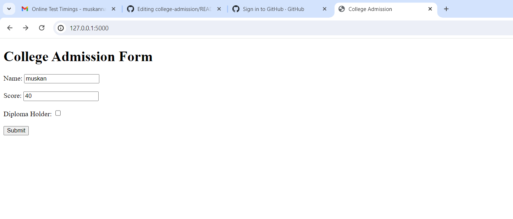
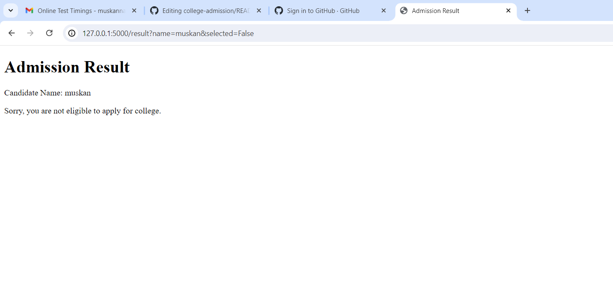
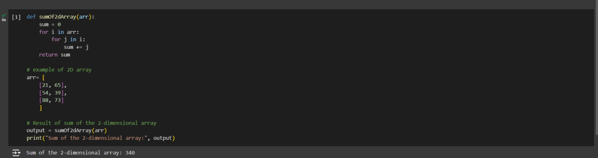
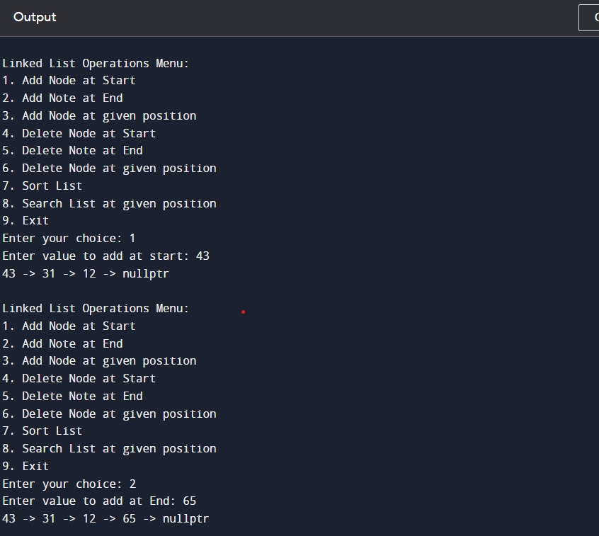
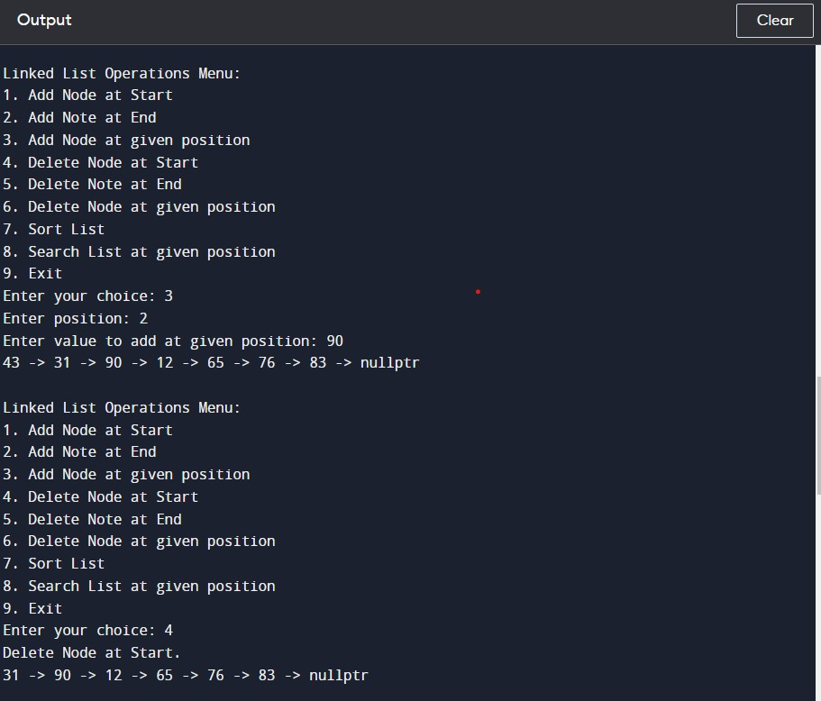
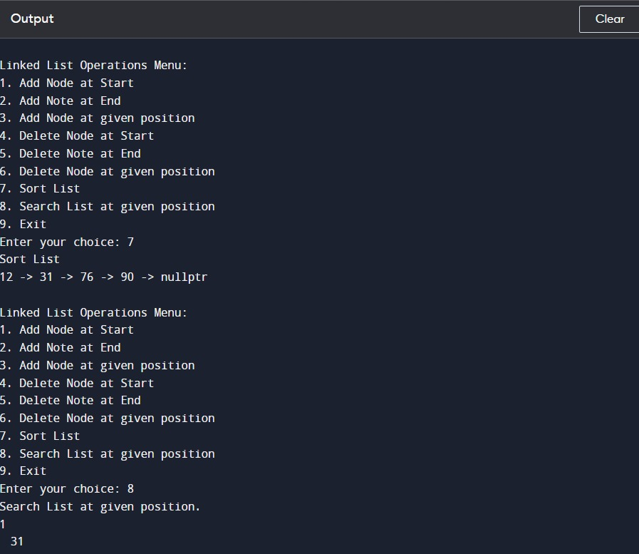
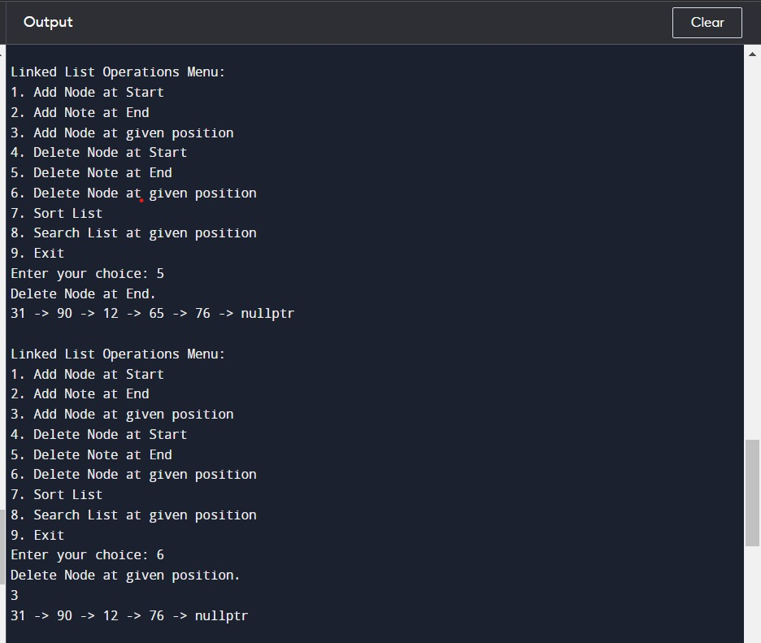

# College Admission Application

This is a simple web application for college admissions built using Flask and SQLite. The application allows users to submit their details and check if they are eligible to apply for college based on their percentage and diploma status.

## Features

- **Submit Details**: Users can enter their name, percentage, and whether they hold a diploma.
- **Eligibility Check**: The application checks if the user is eligible based on the criteria:
  - Percentage is greater than 70.
  - OR the user is a diploma holder.
- **Result Display**: The application displays whether the user is eligible to apply for college.

## Technologies Used

- **Flask**: A micro web framework for Python.
- **SQLite**: A lightweight, disk-based database.
- **HTML/CSS**: For the front-end design.

## Setup Instructions

### Prerequisites

- Python 3.x installed on your system.
- `pip` package installer.

### Installation

1. **Clone the Repository**

    ```bash
    git clone https://github.com/muskannagi2031/college-admission.git
    cd college-admission
    ```

2. **Install Dependencies**

    ```bash
    pip install flask
    ```

3. **Create the Database**

    Run the following script to create the SQLite database and the necessary table:

    ```bash
    python db.py
    ```

4. **Run the Application**

    ```bash
    python app.py
    ```

5. **Access the Application**

    Open your web browser and navigate to `http://127.0.0.1:5000/`.

## Project Structure

```plaintext
college-admission/
├── templates/
│   ├── index.html
│   ├── result.html
├── app.py
├── create_db.py
└── README.md
```

## Images






-------------------------------------------------------------------------------

# 2d Array python 




-------------------------------------------------------------------------------


# Linked lIst C++





